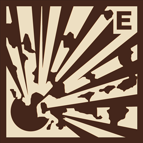

Tests coverage (not including graphical interface): 

<p align="center">

  

</p>

<h1 align="center">
explosivity_and_unsaturations
</h1>

<h2 align="center">
Determine if a compound is explosive and find its unsaturations.
</h2>

<br>

This program is made of two different parts.
The first one can determine if a molecule is explosive, gives the oxygen balance if it is, and highlights in the molecule where the explosible groups are.
The second part calculates the degree of unsaturation and highlights where these unsaturations are in the molecule.

## How to install the package

First, clone the respository on your own device

```
git clone https://github.com/amidecar/Explosivity_and_unsaturations
```

Select the environment in which you want to install the package or create a new environment, you may also give the environment a different name. 

```
conda create -n your_conda_env python=3.10 
```

install the package from the cloned repository

```
conda activate your_conda_env
cd path/to/your/cloned/repository
(your_conda_env)  pip install .
```

If you need jupyter lab to use the package, install it
Or install any other code editor you like such as vscode or spyder

```
(explosivity_and_unsaturations) $ pip install jupyterlab
```

##  How to use the package

```python
#if you want to import only one function, in this example balox
from explosiosivity_and_unsaturations import balox

result_1 = balox(data)

#or import the whole package to get acces to every function
import explosivity_and_unsaturations as eau

result_2 = eau.function(data)
```

## Using that package on your own repository

Initialize Git (only for the first time). 

Note: You should have create an empty repository on `https://github.com:Chemikarl/explosivity_and_unsaturations`.

```
git init
git add .
git commit -m "Initial package upload"
git branch -M main
git remote add origin YOUR_PERSONAL_REMOTE_REPO_URL
git push -u origin main
```

Then add and commit changes as usual. 

To install the package, run

```
(your_conda_env) $ pip install -e ".[test,doc]"
```

## How can I be sure the package works as intended?

To check if the code runs properly and give back the expected result, you can run this two lines in you terminal

```
(your_conda_env) $ pip install tox
(your_conda_env) $ tox
```

## Limitations and known issues

Even though this program works as intended with many molecules, it has some limitations.

The first limitation is the number of atoms in the smiles. Even though we didn't put any limitation on the smiles that can be inputted, the program works better with smiles containing 2000 atoms or less. Some tests were made and the program seems to handle smiles that contain a maximum of 2095 atoms. If you want to use this package keep this in mind!

Another limitation is the number of bond a single atom can have. From our test, the maximum seems to be 127 bonds. This shouldn't be a problem for plausible molecules but it still is a limitation.

The tkinter window appearence is modified in Mac-OS. Some labels overlap and are not visually pleasing. The functionality is not modified however. The visual interface may be modified in the future to accomodate this.

